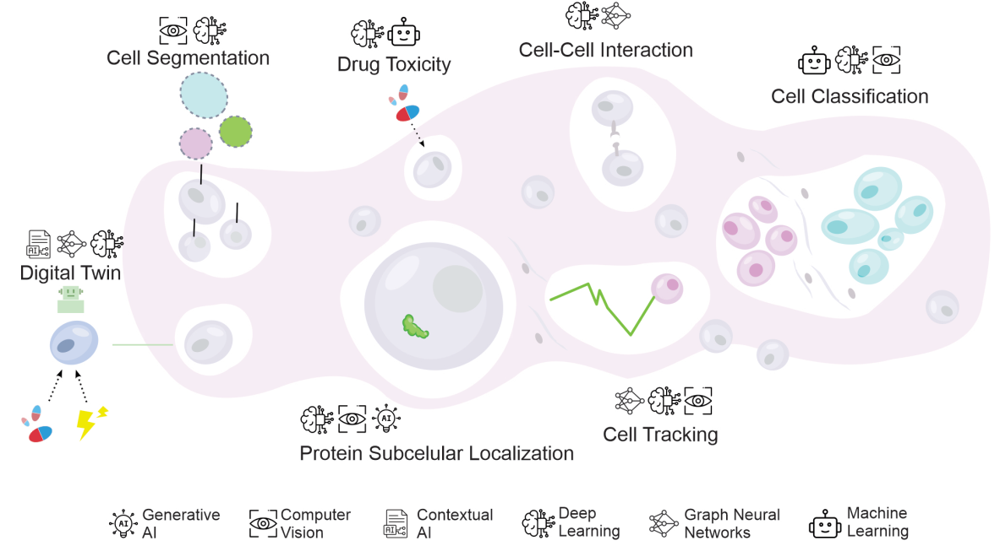

# Large Language Models in Single-Cell and Spatial Transcriptomics
## 1. Why talk about LLMs in this field

In single-cell and spatial transcriptomics, a single experiment can generate expression profiles for hundreds of thousands of cells, dozens of cell types, and thousands of genes, spread across multiple conditions, tissues, and time points. Making sense of this volume of information (data processing, annotating cell types, inferring cell–cell communication, integrating multiple omics layers) or simply keeping up with the literature, has increasingly become a bottleneck that outpaces what a single researcher can process manually.

Artificial intelligence, and more specifically large language models (LLMs), have entered this space from two directions at once. On one side, purpose-built generative models trained directly on single-cell and spatial data (e.g., scGPT, deepGPS, MIDAS, MultiVI, SpatialScope, DeepTalk) are being used to annotate cell types, impute missing values, integrate modalities, and infer spatial gene expression at resolutions that were previously unreachable (Simizo et al., 2026). On the other side, general-purpose conversational LLMs such as ChatGPT are being adopted as everyday assistants for coding, data cleaning, writing, and even hypothesis generation in computational biology labs (Lubiana et al., 2023).

This course is concerned with both fronts, but this introduction focuses on setting the stage: what LLMs can realistically do for you in this domain, what they cannot be trusted to do, and how to use them so that the "goods" outweigh the "bads."

## 2. The goods: what LLMs are actually good for

### 2.1 Handling scale and complexity in omics data
Deep learning and generative AI approaches have transformed several stages of the single-cell and spatial transcriptomics pipeline:

- **Cell type annotation and clustering** — models like scGPT (Cui et al., 2024) and scGNN (Wang et al., 2021) use transformer or graph-based architectures to annotate cell types and impute gene expression with performance that often exceeds classical pipelines.
- **Multi-omics integration** — frameworks such as MIDAS (He et al., 2024) and MultiVI (Ashuach et al., 2023) combine RNA, ATAC, and protein data from different technologies into a single coherent representation, something that is extremely laborious to do by hand.
- **Spatial context** — tools like SpatialScope (Wan et al., 2023) and DeepTalk (Yang et al., 2024) infer transcriptome-wide expression at single-cell resolution from spatial data and reconstruct ligand–receptor interactions, directly supporting the kind of tissue-architecture questions this course addresses.

### 2.2 Accelerating the "boring but necessary" parts of research
Independently of domain-specific models, general-purpose LLMs like Claude and ChatGPT have proven useful for the day-to-day mechanics of computational biology work: making code more readable, writing documentation, generating regular expressions to clean messy metadata, drafting analysis code, improving figures, and helping with academic writing, especially for non-native English speakers. None of this replaces domain expertise, but it removes friction from tasks that otherwise consume a disproportionate share of a researcher's time.

### 2.3 A genuine aid for hypothesis generation — when used with criteria
Perhaps the most interesting (and most debated) use case is hypothesis generation. Frameworks such as FieldSHIFT (O'Brien et al., 2024) use in-context learning to propose candidate research directions by finding analogies across scientific domains, and although their unsupervised success rate is still well below that of human experts, a meaningful fraction of the generated hypotheses have been validated by follow-up analysis (Simizo et al., 2026). This illustrates a useful way to think about LLMs in research: not as oracles that produce ready-made answers, but as **idea amplifiers** — tools that broaden the space of hypotheses a researcher considers, provided that every suggestion is still filtered through domain knowledge and, ideally, experimental or computational validation before it is taken seriously.

## 3. The bads: where LLMs fail or mislead

### 3.1 Hallucination
The single most important limitation to internalize before using any LLM in research is hallucination: the model can generate fluent, confident, and completely fabricated content — nonexistent functions or libraries, invented citations, plausible-sounding but wrong biological claims. This is not a rare edge case; it is a structural property of how these models generate text, and it applies as much to code as to biological reasoning (Lubiana et al., 2023). In a computational biology context this is particularly dangerous because a hallucinated function call or an invented parameter may run without error yet silently corrupt downstream results.

### 3.2 The black-box problem
Even when a model is not hallucinating, its outputs are frequently difficult to interpret. Most deep learning systems used in cell biology (including LLM-based ones) operate as "black boxes," which complicates biological validation, bias detection, and — critically for translational work — regulatory approval and clinical adoption (Simizo et al., 2026). Explainable AI (XAI) techniques such as SHAP, LIME, Grad-CAM++, and attention-based architectures are being developed specifically to address this gap, but interpretability remains an open problem rather than a solved one.

### 3.3 Data quality, bias, and equity
Model performance depends heavily on the quality and representativeness of training data. Batch effects, technical noise, and — especially relevant globally — the underrepresentation of non-European ancestries in single-cell and spatial genomics datasets can bake bias directly into model predictions, an issue that recent Latin American initiatives are explicitly trying to counter by building more inclusive datasets (Simizo et al., 2026).

### 3.4 Overreliance and loss of skills
Finally, there is a human-side risk: overreliance. If a lab becomes dependent on a single external tool for tasks that used to require (and build) in-house expertise, it becomes vulnerable to outages, price changes, or access restrictions, and risks eroding fundamental skills in its trainees. This has practical consequences that go beyond productivity — the same critical thinking needed to catch a hallucinated function is what erodes if it is never exercised (Lubiana et al., 2023).

## 4. Using LLMs "with criteria": a practical mindset

The papers underlying this course converge on a similar message: LLMs are worth adopting, but only within a disciplined workflow. A few concrete practices to carry into this course:

1. **Never trust, always verify.** Treat any LLM-generated code, citation, or biological claim as a draft that must be checked against documentation, the literature, or an independent computational test — you remain responsible for anything you publish, not the model.
2. **Only ask for what you can evaluate.** Use LLMs to help with syntax or concepts you already understand well enough to test; this limits the damage of undetected hallucinations, especially for beginners.
3. **Invest in prompt design.** Vague prompts produce vague, unfocused answers; specifying context, the exact task, and the desired output format substantially improves reliability.
4. **Prefer domain-specific models for domain-specific tasks.** For single-cell and spatial transcriptomics specifically, purpose-trained tools (scGPT, SpatialScope, DeepTalk, MIDAS, MultiVI, etc.) are generally more trustworthy for quantitative analysis than a general-purpose chatbot, which is better suited to code support, writing, and brainstorming (Simizo et al., 2026).
5. **Use LLMs to widen, not replace, your hypothesis space.** Let them suggest candidate directions or analogies, then subject each candidate to the same scrutiny you would apply to a hypothesis proposed by a colleague.
6. **Keep humans and human interaction in the loop.** Preserve practices like code review, pair programming, and lab discussionsç. These remain the best defense against both technical errors and the erosion of expertise.

---

### References

- Simizo, A., de Morais, M., Vesco, M., & Nakaya, H. (2026). Leveraging AI for cell biology discovery. *Biochemical Society Transactions*, 54, 1–13. https://doi.org/10.1042/BST20253023
- Lubiana, T., Lopes, R., Medeiros, P., Silva, J. C., Goncalves, A. N. A., Maracaja-Coutinho, V., & Nakaya, H. I. (2023). Ten quick tips for harnessing the power of ChatGPT in computational biology. *PLOS Computational Biology*, 19(8), e1011319. https://doi.org/10.1371/journal.pcbi.1011319
- Cui, H., Wang, C., Maan, H., Pang, K., Luo, F., Duan, N., & Wang, B. (2024). scGPT: toward building a foundation model for single-cell multi-omics using generative AI. Nature methods, 21(8), 1470-1480.
- Wang, J., Ma, A., Chang, Y., Gong, J., Jiang, Y., Qi, R., ... & Xu, D. (2021). scGNN is a novel graph neural network framework for single-cell RNA-Seq analyses. Nature communications, 12(1), 1882.
- He, Z., Hu, S., Chen, Y., An, S., Zhou, J., Liu, R., ... & Ying, X. (2024). Mosaic integration and knowledge transfer of single-cell multimodal data with MIDAS. Nature biotechnology, 42(10), 1594-1605.
- Ashuach, T., Gabitto, M. I., Koodli, R. V., Saldi, G. A., Jordan, M. I., & Yosef, N. (2023). MultiVI: deep generative model for the integration of multimodal data. Nature methods, 20(8), 1222-1231.
- Wan, Xiaomeng, Jiashun Xiao, Sindy Sing Ting Tam, Mingxuan Cai, Ryohichi Sugimura, Yang Wang, Xiang Wan, Zhixiang Lin, Angela Ruohao Wu, and Can Yang. "Integrating spatial and single-cell transcriptomics data using deep generative models with SpatialScope." Nature Communications 14, no. 1 (2023): 7848.
- Yang, Wenyi, Pingping Wang, Shouping Xu, Tao Wang, Meng Luo, Yideng Cai, Chang Xu et al. "Deciphering cell–cell communication at single-cell resolution for spatial transcriptomics with subgraph-based graph attention network." Nature Communications 15, no. 1 (2024): 7101.
- O'Brien, Thomas, Joel Stremmel, Léo Pio-Lopez, Patrick McMillen, Cody Rasmussen-Ivey, and Michael Levin. "Machine learning for hypothesis generation in biology and medicine: exploring the latent space of neuroscience and developmental bioelectricity." Digital Discovery 3, no. 2 (2024): 249-263.
