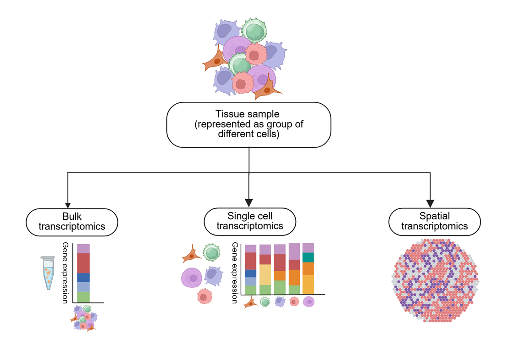

# Material for the Mini Course "Single cell/Spatial Transcriptomics" held @ WCI 2026

**Single-cell** and **spatial transcriptomics** are transforming how we study biology. Traditional approaches often measure gene expression across large populations of cells, which can hide important differences between individual cells. In contrast, single-cell technologies allow us to explore individual cells and their molecular states, while spatial transcriptomics adds another layer by showing where those cells are located and how they are organized within tissues.

Therefore, these technologies open the door to questions that were previously difficult or impossible to answer. Which immune cells are present in a tissue, and how do their states change during inflammation? Which cells are producing inflammatory signals, and which cells are responding to them? How do immune cells interact with epithelial, stromal, or other tissue cells? And where do these interactions occur within the tissue?

At the same time, working with single-cell and spatial data can feel overwhelming at first. Datasets can be large and complex, terminology can be unfamiliar, and analyses often involve specialized computational tools or programming skills. This course is designed to make these technologies more approachable. We will start by exploring user-friendly tools that allow you to interact with single-cell and spatial data without writing code. We will then move into reproducible analysis with R and Python, before exploring how AI can help us write, test, and improve analytical workflows.

## What are these technologies, after all?

Before we start exploring the tools and analyses, let's take a moment to understand what **single-cell and spatial transcriptomics** actually measure and why they are so useful.

### Single-cell transcriptomics

In a traditional bulk RNA-seq experiment, RNA is collected from a large population of cells and measured together. The resulting expression profile represents an **average across all of those cells**. This can be useful, but it can also hide important biological differences. Imagine a tissue containing immune cells, epithelial cells, fibroblasts, and endothelial cells. If all of their RNA is mixed together, we can see which genes are expressed in the tissue overall—but we may not know **which cells are expressing those genes**. Single-cell transcriptomics changes this by separating the sample into individual cells—or, more precisely, individual cell-derived measurements—and profiling their gene expression separately.

Instead of asking:

> *What genes are expressed in this tissue?*

we can begin to ask:

> **Which cells are present, what are they expressing, and how do their molecular states differ?**

This is particularly powerful for studying **immune responses and inflammation**. A tissue that appears to have a strong inflammatory response may contain several different immune populations, each with distinct roles. Single-cell data can help us distinguish these populations and explore their molecular states—for example, identifying activated macrophages, different T-cell states, or inflammatory signaling programs.

### Spatial transcriptomics

Single-cell transcriptomics gives us detailed information about what cells are doing, but in many experiments we lose an important piece of information: where those cells were located within the tissue. This spatial context is particularly important when studying inflammation, where cellular behavior is strongly influenced by the local microenvironment. Immune cells, stromal cells, epithelial cells, and other cell types can occupy distinct tissue niches and interact with one another through localized signaling, cell–cell contacts, and gradients of cytokines and other molecular factors. Knowing where cells are located therefore allows us to understand not only which genes and pathways are active, but also where inflammatory processes are occurring and how neighboring cells contribute to or respond to them. Preserving spatial information can reveal localized molecular processes, identify inflammatory niches, and help uncover interactions between different cell populations that may be missed when tissue architecture is lost. Spatial transcriptomics addresses this by measuring gene expression while preserving information about its **spatial location**.

This allows us to ask questions such as:

> **Where are inflammatory cells located?**

> **Which regions of a tissue show inflammatory activity?**

> **Are immune cells located close to the cells they may be interacting with?**

> **Do particular cellular states occur in specific tissue structures or microenvironments?**

In other words, spatial transcriptomics allows us to connect **molecular identity with tissue organization**.

### Putting the pieces together

Single-cell and spatial transcriptomics therefore provide complementary perspectives:

- **Single-cell:** *Who is there, and what are they doing?*
- **Spatial:** *Where are they, and what is happening around them?*

Together, these technologies allow us to move beyond simply describing which genes are expressed. Single-cell and spatial transcriptomics approaches provide complementary perspectives on tissue biology: single-cell methods can provide high-resolution characterization of individual cell populations and their transcriptional states, while spatial methods preserve information about where those cells and molecular programs are located within the tissue. Importantly, not all spatial transcriptomic technologies resolve individual cells, and different approaches vary in their spatial resolution, molecular detection strategies, and whether they rely on targeted, probe-based measurements or untargeted sequencing. By integrating these complementary views, we can begin to understand which cells are involved, how their states change, how they communicate, and where these processes occur within a tissue. This is particularly valuable in inflammation, where cellular states and molecular interactions are often shaped by their local microenvironment and spatial organization.

## The course at a glance

| Class | Focus | Main question |
|:---:|---|---|
| **1** | User-friendly exploration | *What can we learn from single-cell and spatial data?* |
| **2** | Reproducible analysis | *How do we actually perform these analyses?* |
| **3** | AI-assisted analysis | *How can AI help us go beyond the standard workflow?* |

## A note about AI

AI can be a powerful assistant for computational biology, but it is **not a substitute for scientific reasoning**.

Throughout the course, we will emphasize an important principle:

::: {.callout-warning}
## AI is a copilot, not the scientist

AI can help us write and explore analyses, but **we are responsible for understanding, testing, and interpreting the results**.
:::

AI-generated code can contain errors, use nonexistent functions, rely on outdated packages, or suggest analyses that are inappropriate for a particular dataset.

Learning how to **critically evaluate AI-generated suggestions** is therefore just as important as learning how to generate them.

## By the end of the course

You should be able to:

- Recognize the main concepts and terminology used in single-cell and spatial transcriptomics.
- Explore single-cell and spatial datasets using user-friendly online platforms.
- Understand the logic behind a standard analysis pipeline.
- Run basic analyses using **Seurat** in R and **Scanpy** in Python.
- Apply principles of computational reproducibility.
- Use AI tools to help write, test, debug, and improve analytical code.
- Critically evaluate computational and biological suggestions generated by AI.

Most importantly, we hope you leave the course feeling that **single-cell and spatial transcriptomics are approachable tools rather than a black box**.

## Ready to start?

Let's begin by exploring what these datasets actually look like **without writing a single line of code**.

[**Start Class 1 →**](classes/class-01.qmd)
